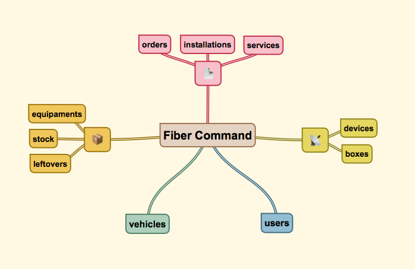

# Fiber Command
## Steps to run

    yarn install
    yarn dev

//or

    yarn start

## Mind map

---

## Team

### User
|Método|Endpoint|Função|Descrição|
|---|---|---|---|
|POST|/users|create|Criar usuário|
|GET|/users|find|Buscar usuários|
|GET|/users/:id|findOne|Buscar um usuário|
|PUT|/users/:id|edit|Editar usuário|
|DELETE|/users/:id|remove|Remover usuário|
|PUT|/users/suspend/:id|suspend|Suspender usuário|
|PUT|/users/active/:id|active|Ativar usuário|

---

## Vehicle fleet

### Vehicle
|Método|Endpoint|Função|Descrição|
|---|---|---|---|
|POST|/vehicles|create|Criar veículo|
|GET|/vehicles|find|Buscar veículos|
|GET|/vehicles/:id|findOne|Buscar um veículo|
|PUT|/vehicles/:id|edit|Editar veículo|
|DELETE|/vehicles/:id|remove|Remover veículo|

---

## Network

### Device
|Método|Endpoint|Função|Descrição|
|---|---|---|---|
|POST|/devices|create|Criar dispositivo|
|GET|/devices|find|Buscar dispositivos|
|GET|/devices/:id|findOne|Buscar um dispositivo|
|PUT|/devices/:id|edit|Editar dispositivo|
|DELETE|/devices/:id|remove|Remover dispositivo|
|PUT|/devices/up/:id|up|Ativar dispositivo|
|PUT|/devices/down/:id|down|Desativar dispositivo|

---

### Box
|Método|Endpoint|Função|Descrição|
|---|---|---|---|
|POST|/boxes|create|Criar caixa|
|GET|/boxes|find|Buscar caixas|
|GET|/boxes/:id|findOne|Buscar um caixa|
|PUT|/boxes/:id|edit|Editar caixa|
|DELETE|/boxes/:id|remove|Remover caixa|
|PUT|/boxes/approve/:id|approve|Aprovar caixa|
|PUT|/boxes/disapprove/:id|disapprove|Desaprovar caixa|

---

## Equipaments

### Equipament
|Método|Endpoint|Função|Descrição|
|---|---|---|---|
|POST|/equipaments|create|Criar equipamento|
|GET|/equipaments|find|Buscar equipamentos|
|GET|/equipaments/:id|findOne|Buscar um equipamento|
|PUT|/equipaments/:id|edit|Editar equipamento|
|DELETE|/equipaments/:id|remove|Remover equipamento|

---

### Stock
|Método|Endpoint|Função|Descrição|
|---|---|---|---|
|POST|/stock|create|Criar registro no estoque|
|GET|/stock|find|Buscar registros no estoque|
|GET|/stock/:id|findOne|Buscar um registro no estoque|
|PUT|/stock/:id|edit|Editar registro no estoque|
|DELETE|/stock/:id|remove|Remover registro no estoque|

---

### Leftover
|Método|Endpoint|Função|Descrição|
|---|---|---|---|
|POST|/leftover|create|Criar sobra|
|GET|/leftover|find|Buscar sobras|
|GET|/leftover/:id|findOne|Buscar uma sobra|
|PUT|/leftover/:id|edit|Editar sobra|
|DELETE|/leftover/:id|remove|Remover sobra|

---

## Services

### Service
|Método|Endpoint|Função|Descrição|
|---|---|---|---|
|POST|/services|create|Criar serviço|
|GET|/services|find|Buscar serviços|
|GET|/services/:id|findOne|Buscar um serviço|
|PUT|/services/:id|edit|Editar serviço|
|DELETE|/services/:id|remove|Remover serviço|

---

### Order
|Método|Endpoint|Função|Descrição|
|---|---|---|---|
|POST|/orders|create|Criar ordem|
|GET|/orders|find|Buscar ordens|
|GET|/orders/:id|findOne|Buscar uma ordem|
|PUT|/orders/:id|edit|Editar ordem|
|DELETE|/orders/:id|remove|Remover ordem|

---

### Installation
|Método|Endpoint|Função|Descrição|
|---|---|---|---|
|POST|/installations|create|Criar instalação|
|GET|/installations|find|Buscar instalações|
|GET|/installations/:id|findOne|Buscar uma instalação|
|PUT|/installations/:id|edit|Editar instalação|
|DELETE|/installations/:id|remove|Remover instalação|